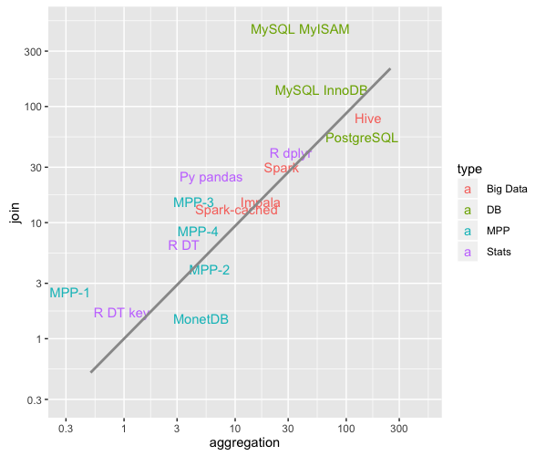

### Simple/basic/limited/incomplete benchmark for operations on tabular data (aggregates and joins)

For structured/tabular/relational data most transformations for data analysis are based on a few
primitives. Computationally, aggregates and joins are taking the majority
of time. This project aims at a *minimal* benchmark of various tools 
(statistical software, databases etc.) for working with tabular data of moderately
large sizes (but still within the reach of interactive data analysis - response times
of a few seconds on commodity hardware).


#### Tools

The tools analysed are:

1. Statistical software: R (dplyr, data.table) and Python (pandas)
2. Databases (MySQL, PostgreSQL)
3. Analytical databases (3 MPP/columnar stores)
4. "Big data" systems (Hive, Impala, Spark)

All but the analytical databases are open source. The analytical databases have free (community) editions
or unexpensive cloud offerings. 

**Update:** @hannesmuehleisen submitted results for MonetDB, an analytical/columnar db that unlike all the
above is open source.

**Update:** @JazzFan submitted results for another analytical db ("MPP-4" here) 

R/Python operate in memory and can integrate the tabular operations
with rich visualization, statistical modeling etc. On the other hand, they are limited to data sizes
that fit in RAM, run single-threaded, and unlike the other systems do not have a query optimizer.

MySQL/PostgreSQL have been designed for mixed OLTP/analytical workloads and while 
the database can use multiple cores to run different queries, any given query runs
on one processor core only.

The analytical databases and the "big data" systems can scale-out to multiple nodes (and use all cores on them). 
The analytical (MPP) databases have parallel/shared-nothing architecture, columnar storage, compression and are specifically
designed for large aggregations and joins.

Hive/Spark are based on the map-reduce paradigm, SQL operations are translated to 
map/shuffle/reduce primitives (Hive generates traditional Hadoop jobs, while Spark leverages in-memory
architecture). Impala uses MPP-like technology to query data in HDFS (Hadoop's distributed file system).


#### Data

The data is [randomly generated](0-gendata.txt): 
one table `d` (`x` integer, `y` float) of 100 million rows for aggregation
(`x` takes 1 million distinct values) and another table `dm` (`x` integer) of 1 million rows for the join only.
(The larger table `d` is of ~2GB size in the CSV format and results in ~1GB usage when loaded in database or
read in memory.)


#### Transformations

SQL query for aggregation:

```
select x, avg(y) as ym 
from d 
group by x
order by ym desc 
limit 5;
```

and for join:

```
select count(*) as cnt 
from d
inner join dm on d.x = dm.x;
```


#### Setup

The tests have been performed on a m3.2xlarge EC2 instance (8 cores, 30GB RAM) running Ubuntu 14.04.
The queries have been run 2 times and the second
time was recorded (warm run). In this case various caching mechanisms come into play and the data is
effectively in RAM. 

While I'm a great fan of reproducibility, in this benchmark I'm more interested in orders
of magnitude and not strict precision and exact reproducibility. With some more work one can create install and test
scripts that can run in a fully automated fashion for complete reproducibility.

The software tools have been installed with the latest available 
[versions](versions.txt)
using standard instructions with no tuning 
(with a few exceptions as noted). For Hive/Impala/Spark Amazon's EMR was used to avoid a more ellaborate installation.


The following running times have been measured:

1. For R/Python data has been read from csv file and then aggregates/joins happen in memory.
2. For MySQL/Postgres and the analytical databases, the data has to be loaded first into the database, and only then 
can one run queries.
3. For the "Big Data" systems the data has to be copied into HDFS (much faster than loading it to a database); 
optionally it can be transformed into a columnar format (such as parquet). Queries can run readily. For Spark the data
can be either read from HDFS on the fly or loaded into memory (cached) and then queried.


#### Limitations

This is far from a comprehensive benchmark. It is my attempt to *quickly* get an idea of the order
of magnitude of running times for aggregations and joins on datasets of sizes of interest to *me* at the moment. 

The results are expected to vary with hardware, tuning, and likely even more with dataset size, 
dataset structure, or the number of nodes for the scale-out systems etc. Perhaps the strongest
critique against the general relevance of this benchmark could be that it uses a certain
data size and structure only, instead of examining a variety of.

I'm not looking in detail either at the scaling by the number of nodes for the 
big data systems as I'm primarily concerned with the efficiency on a single or a small number of nodes.

In the tests the only computation running on the system is the target query, therefore I'm not
studying the behavior in function of the load (e.g. the number of concurrent queries running on the system).

Finally, one might say that queries in practice are complex and the running times depend not only 
on how fast are these primitives, but also on how the query optimizer can deal with complexity. Again,
a comprehensive SQL benchmark is out of the scope here (but see e.g. TPC-DS).


#### Results

(times in seconds)

|  Type      | System                              |  Load/Read    |   Aggregation  |   Join   |
| ---------- | ----------------------------------- | ------------- | -------------- | -------- |
|  Stats     | [R DT](1a-R-datatable.txt)          |   30          |       5.5      |    6.5   |
|  Stats     | [R DT key](1a-R-datatable.txt)      |   35          |       1.3      |    1.7   |
|  Stats     | [R dplyr](1b-R-dplyr.txt)           |   30          |       45       |    40    |
|  Stats     | [Py pandas](1c-python-pandas.txt)   |   30          |       8        |    25    |
|  DB        | [MySQL MyISAM](2a-mysql.txt)        |   40          |       45       |    470   |  
|  DB        | [MySQL InnoDB](2a-mysql.txt)        |   430         |       70       |    140   |
|  DB        | [PostgreSQL](2b-postgres.txt)       |   120         |       175      |    55    |
|  MPP       | MPP-1                               |   70          |       0.5      |    2.5   |
|  MPP       | MPP-2                               |   130         |       9        |    4     |
|  MPP       | MPP-3                               |   130         |       6.5      |    15    |
|  MPP       | MPP-4                               |   102         |       7.1      |    8.5   |
|  Big Data  | [Hive](3a-hive.txt)                 |   20          |       250      |    80    |
|  Big Data  | [Impala](3b-impala.txt)             |   20          |       25       |    15    |
|  Big Data  | [Spark](3c-spark.txt)               |   20          |       120      |    130   |
|  Big Data  | [Spark cached](3c-spark.txt)        |   50          |       90       |    17    |


**Update:** [Timings](https://gist.github.com/szilard/7d810877fcc6b019a478#gistcomment-1693662) 
by @hannesmuehleisen on MonetDB on same m3.2xlarge: aggregation 7.0, join 1.5.

**Update:** With newer [versions](versions.txt) of Hive and Spark:

|  System        |   Aggr  |   Join   |
|----------------|---------|----------|
| Hive           |  250    |    100   |
| Spark          |   40    |     30   |
| Spark cached   |   12    |     15   |



Multinode results (with older versions of Spark/Hive):

| System        | Aggr 1-node | Aggr 5-node | Join 1-node | Join 5-node |
| ------------- | ----------- | ----------- | ----------- | ----------- |
| Hive          |    250      |   160       |    80       |     50      |
| Impala        |    25       |   16        |    15       |     10      |
| Spark         |    120      |   50        |    130      |     30      |
| Spark cached  |    90       |   40        |    17       |     10      |


#### Discussions

It seems that for data manipulation with ~100 million rows / ~1GB datasets MPP databases
are the fastest, next statistical software, then traditional databases, and finally big data
systems (see graph above). Some more insights can be gained from 
[query plans](query_plans.txt).

The largest surprize (to me) is that traditional databases (MySQL/PostgreSQL) perform so poorly
at this size. 

Naturally, analytical databases are the fastest. Even on 1 node, their columnar architecture and
the features that come with it (efficient binary storage format, compression) along with the 
ability to process a query on multiple processor cores are ideal for the task.

Statistical software fares pretty well. While not able to use multiple cores and no query planning,
the data is in RAM in a format that makes this type of processing fast. (For the primitives studied, query
planning does not play an important role such as for complex queries.)

As an MPP-like tool but with data stored in Hadoop, Impala achieves higher performance than traditional
Hadoop tools, but it is significantly slower than the full MPPs that can marshall their data as they 
please. 

While traditional databases like MySQL/PostgreSQL aim to be reasonable for both OLTP and analytical 
workloads, it comes as a surprize that even for 1GB sizes (which in today's terms is not large at all)
they perform so poorly.

While it is no surprize that Hive (which generates traditional Hadoop map-reduce jobs) is the slowest, 
the order of magnitude (100x vs analytical databases) is surprizing a bit.

Spark is a new map-reduce like architecture that leverages in-memory computations, therefore significantly faster 
than Hive (especially when data is first read/cached in memory), but stays slower for example than Impala.

For ever larger datasets, statistical software will run out of memory, while traditional databases
seem to become prohibitively slow. MPPs and big data systems can scale-out to multiple nodes, though 
the speed advantage of MPPs seems so large that it's hard to imagine anything but extreme data sizes
when the big data systems can overcome the MPPs (though their respective scaling in function of the number 
of nodes has to be studied).


